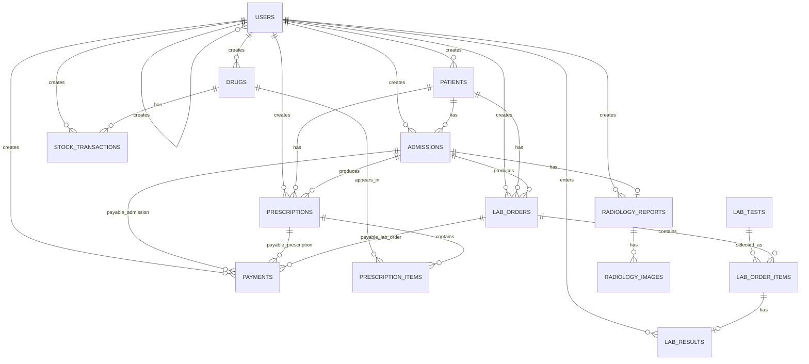

# HIS Data Model and Relations

This document describes the implemented SQLite data structure for the Hospital Information System. It is intended as a source for UML class diagrams, EER diagrams, database documentation, and implementation reviews.

The canonical schema is created by `init_db()` in `database.py`.

## 1. Entity Overview

Implemented entities:

| Entity | Table | Purpose |
| --- | --- | --- |
| User | `users` | Staff accounts, roles, authentication metadata |
| Patient | `patients` | Permanent patient demographic record |
| Admission | `admissions` | Encounter/admission for doctor, laboratory, or radiology |
| Payment | `payments` | Cashier payment/cancellation record for payable items |
| Drug | `drugs` | Medication catalog |
| StockTransaction | `stock_transactions` | Inventory ledger for drug stock changes |
| Prescription | `prescriptions` | Prescription header |
| PrescriptionItem | `prescription_items` | Prescription medication line item |
| LabTest | `lab_tests` | Laboratory catalog and reference ranges |
| LabOrder | `lab_orders` | Laboratory order header |
| LabOrderItem | `lab_order_items` | Individual ordered laboratory test |
| LabResult | `lab_results` | Result value for a lab order item |
| RadiologyReport | `radiology_reports` | Radiology report for a radiology admission |
| RadiologyImage | `radiology_images` | Uploaded image metadata for a radiology report |

## 2. Enumerations and Controlled Values

These values are stored as text in SQLite.

### User.role

- `admin`
- `reception`
- `doctor`
- `laboratory`
- `radiologist`
- `pharmacy`

### Patient.gender

- `male`
- `female`
- `other`

### Admission.admission_type

- `doctor`
- `laboratory`
- `radiology`

### Admission.status

- `waiting_payment`
- `paid`
- `completed`
- `cancelled`

### Payment.payable_type

- `admission`
- `prescription`
- `lab_order`

### Payment.status

- `paid`
- `cancelled`

### Prescription.status

- `waiting_payment`
- `paid`
- `dispensed`
- `cancelled`

### LabOrder.status

- `waiting_payment`
- `paid`
- `collected`
- `resulted`
- `cancelled`

### LabResult.flag

- `low`
- `normal`
- `high`
- `NULL` when not applicable or not parseable

## 3. Table Data Dictionary

### 3.1 users

Stores staff accounts.

| Column | Type | Constraints | Notes |
| --- | --- | --- | --- |
| `id` | INTEGER | PK, autoincrement | User identifier |
| `username` | TEXT | UNIQUE, NOT NULL | Login name |
| `password_hash` | TEXT | NOT NULL | Passlib hash |
| `full_name` | TEXT | NOT NULL | Display name |
| `role` | TEXT | NOT NULL | See `User.role` values |
| `is_active` | INTEGER | DEFAULT 1 | Boolean-like active flag |
| `created_at` | TEXT | DEFAULT CURRENT_TIMESTAMP | Timestamp text |
| `created_by` | INTEGER | Nullable | Logical FK to `users.id` |

Relationships:

- `users.created_by` -> `users.id` many-to-one, optional.
- Referenced by audit columns in most workflow tables.

### 3.2 patients

Stores patient demographics.

| Column | Type | Constraints | Notes |
| --- | --- | --- | --- |
| `id` | INTEGER | PK, autoincrement | Patient identifier |
| `national_id` | TEXT | UNIQUE, NOT NULL | National identity code |
| `full_name` | TEXT | NOT NULL | Patient name |
| `phone` | TEXT | NOT NULL | Contact phone |
| `birth_date` | TEXT | NOT NULL | Date stored as text |
| `gender` | TEXT | NOT NULL | See `Patient.gender` |
| `address` | TEXT | Nullable | Address |
| `created_at` | TEXT | DEFAULT CURRENT_TIMESTAMP | Timestamp text |
| `created_by` | INTEGER | NOT NULL | Logical FK to `users.id` |

Relationships:

- `patients.created_by` -> `users.id` many-to-one.
- One patient has many admissions.
- One patient has many prescriptions.
- One patient has many lab orders.

### 3.3 admissions

Stores service encounters.

| Column | Type | Constraints | Notes |
| --- | --- | --- | --- |
| `id` | INTEGER | PK, autoincrement | Admission identifier |
| `patient_id` | INTEGER | NOT NULL | Logical FK to `patients.id` |
| `admission_type` | TEXT | NOT NULL | `doctor`, `laboratory`, `radiology` |
| `description` | TEXT | NOT NULL | Complaint, reason, or clinical note |
| `radiology_type` | TEXT | Nullable | MRI, CT, X-Ray, etc. |
| `status` | TEXT | DEFAULT `waiting_payment` | Admission status |
| `created_at` | TEXT | DEFAULT CURRENT_TIMESTAMP | Timestamp text |
| `created_by` | INTEGER | NOT NULL | Logical FK to `users.id` |
| `paid_at` | TEXT | Nullable | Payment timestamp |
| `paid_by` | INTEGER | Nullable | Logical FK to `users.id` |
| `completed_at` | TEXT | Nullable | Completion timestamp |

Relationships:

- `admissions.patient_id` -> `patients.id` many-to-one.
- `admissions.created_by` -> `users.id` many-to-one.
- `admissions.paid_by` -> `users.id` many-to-one, optional.
- One doctor admission may have many prescriptions.
- One admission may have many lab orders.
- One radiology admission may have one radiology report.
- One payment may point to an admission through `payments.payable_type = 'admission'`.

Notes for diagrams:

- Laboratory admissions currently create a linked `lab_orders` row and mark the admission completed immediately.
- Doctor admissions are completed by the doctor.
- Radiology admissions are completed by the radiologist.

### 3.4 payments

Stores cashier transactions.

| Column | Type | Constraints | Notes |
| --- | --- | --- | --- |
| `id` | INTEGER | PK, autoincrement | Payment identifier |
| `payable_type` | TEXT | NOT NULL | `admission`, `prescription`, or `lab_order` |
| `payable_id` | INTEGER | NOT NULL | Polymorphic target ID |
| `amount` | NUMERIC | NOT NULL | Paid amount |
| `receipt_number` | TEXT | Nullable | Generated receipt number |
| `status` | TEXT | DEFAULT `paid` | Payment status |
| `created_at` | TEXT | DEFAULT CURRENT_TIMESTAMP | Timestamp text |
| `created_by` | INTEGER | NOT NULL | Logical FK to `users.id` |

Relationships:

- `payments.created_by` -> `users.id` many-to-one.
- Polymorphic relation:
  - if `payable_type = 'admission'`, `payable_id` -> `admissions.id`
  - if `payable_type = 'prescription'`, `payable_id` -> `prescriptions.id`
  - if `payable_type = 'lab_order'`, `payable_id` -> `lab_orders.id`

Diagram note:

- Model `Payment` with three optional associations or a polymorphic association stereotype.

### 3.5 drugs

Stores medication catalog data.

| Column | Type | Constraints | Notes |
| --- | --- | --- | --- |
| `id` | INTEGER | PK, autoincrement | Drug identifier |
| `name` | TEXT | NOT NULL | Drug name |
| `manufacturer` | TEXT | NOT NULL | Manufacturer |
| `form` | TEXT | NOT NULL | Tablet, capsule, syrup, etc. |
| `dosage` | TEXT | NOT NULL | Strength |
| `default_instructions` | TEXT | NOT NULL | Default use instructions |
| `price` | NUMERIC | NOT NULL | Unit price |
| `min_threshold` | INTEGER | DEFAULT 10 | Low-stock threshold |
| `created_at` | TEXT | DEFAULT CURRENT_TIMESTAMP | Timestamp text |
| `created_by` | INTEGER | NOT NULL | Logical FK to `users.id` |

Relationships:

- `drugs.created_by` -> `users.id` many-to-one.
- One drug has many stock transactions.
- One drug appears in many prescription items.

Derived data:

- Current stock = `SUM(stock_transactions.quantity_change)` grouped by `drug_id`.

### 3.6 stock_transactions

Stores the drug inventory ledger.

| Column | Type | Constraints | Notes |
| --- | --- | --- | --- |
| `id` | INTEGER | PK, autoincrement | Transaction identifier |
| `drug_id` | INTEGER | NOT NULL | Logical FK to `drugs.id` |
| `quantity_change` | INTEGER | NOT NULL | Positive for stock-in, negative for stock-out |
| `reason` | TEXT | NOT NULL | Human-readable reason |
| `created_at` | TEXT | DEFAULT CURRENT_TIMESTAMP | Timestamp text |
| `created_by` | INTEGER | NOT NULL | Logical FK to `users.id` |

Relationships:

- `stock_transactions.drug_id` -> `drugs.id` many-to-one.
- `stock_transactions.created_by` -> `users.id` many-to-one.

### 3.7 prescriptions

Stores prescription headers.

| Column | Type | Constraints | Notes |
| --- | --- | --- | --- |
| `id` | INTEGER | PK, autoincrement | Prescription identifier |
| `patient_id` | INTEGER | NOT NULL | Logical FK to `patients.id` |
| `admission_id` | INTEGER | Nullable | Logical FK to `admissions.id`; NULL for manual prescriptions |
| `is_manual` | INTEGER | DEFAULT 0 | Boolean-like manual prescription flag |
| `total_amount` | NUMERIC | NOT NULL | Sum of item drug price * quantity |
| `status` | TEXT | DEFAULT `waiting_payment` | Prescription status |
| `created_at` | TEXT | DEFAULT CURRENT_TIMESTAMP | Timestamp text |
| `created_by` | INTEGER | NOT NULL | Logical FK to `users.id` |
| `dispensed_at` | TEXT | Nullable | Dispensing timestamp |
| `dispensed_by` | INTEGER | Nullable | Logical FK to `users.id` |

Relationships:

- `prescriptions.patient_id` -> `patients.id` many-to-one.
- `prescriptions.admission_id` -> `admissions.id` many-to-one, optional.
- `prescriptions.created_by` -> `users.id` many-to-one.
- `prescriptions.dispensed_by` -> `users.id` many-to-one, optional.
- One prescription has many prescription items.
- One payment may point to a prescription through `payments.payable_type = 'prescription'`.

### 3.8 prescription_items

Stores drug line items in prescriptions.

| Column | Type | Constraints | Notes |
| --- | --- | --- | --- |
| `id` | INTEGER | PK, autoincrement | Item identifier |
| `prescription_id` | INTEGER | NOT NULL | Logical FK to `prescriptions.id` |
| `drug_id` | INTEGER | NOT NULL | Logical FK to `drugs.id` |
| `quantity` | INTEGER | NOT NULL | Dispensed quantity |
| `instructions` | TEXT | NOT NULL | Item-specific instructions |

Relationships:

- `prescription_items.prescription_id` -> `prescriptions.id` many-to-one.
- `prescription_items.drug_id` -> `drugs.id` many-to-one.

### 3.9 radiology_reports

Stores report text for radiology admissions.

| Column | Type | Constraints | Notes |
| --- | --- | --- | --- |
| `id` | INTEGER | PK, autoincrement | Report identifier |
| `admission_id` | INTEGER | UNIQUE, NOT NULL | Logical FK to `admissions.id` |
| `report_text` | TEXT | NOT NULL | Radiology interpretation |
| `created_at` | TEXT | DEFAULT CURRENT_TIMESTAMP | Timestamp text |
| `created_by` | INTEGER | NOT NULL | Logical FK to `users.id` |

Relationships:

- `radiology_reports.admission_id` -> `admissions.id` one-to-one.
- `radiology_reports.created_by` -> `users.id` many-to-one.
- One radiology report has many radiology images.

### 3.10 radiology_images

Stores uploaded image metadata.

| Column | Type | Constraints | Notes |
| --- | --- | --- | --- |
| `id` | INTEGER | PK, autoincrement | Image identifier |
| `report_id` | INTEGER | NOT NULL | Logical FK to `radiology_reports.id` |
| `filename` | TEXT | NOT NULL | UUID filename stored in `uploads/` |
| `uploaded_at` | TEXT | DEFAULT CURRENT_TIMESTAMP | Timestamp text |

Relationships:

- `radiology_images.report_id` -> `radiology_reports.id` many-to-one.

### 3.11 lab_tests

Stores laboratory service catalog and reference ranges.

| Column | Type | Constraints | Notes |
| --- | --- | --- | --- |
| `id` | INTEGER | PK, autoincrement | Test identifier |
| `code` | TEXT | UNIQUE, NOT NULL | Test code such as CBC or FBS |
| `name` | TEXT | NOT NULL | Test name |
| `category` | TEXT | Nullable | Hematology, Biochemistry, etc. |
| `sample_type` | TEXT | Nullable | Serum, whole blood, urine, etc. |
| `price` | NUMERIC | NOT NULL, DEFAULT 0 | Test price |
| `male_normal_range` | TEXT | Nullable | Parseable range when possible |
| `female_normal_range` | TEXT | Nullable | Parseable range when possible |
| `unit` | TEXT | Nullable | Result unit |
| `is_active` | INTEGER | DEFAULT 1 | Boolean-like catalog visibility |

Relationships:

- One lab test appears in many lab order items.

### 3.12 lab_orders

Stores laboratory order headers.

| Column | Type | Constraints | Notes |
| --- | --- | --- | --- |
| `id` | INTEGER | PK, autoincrement | Order identifier |
| `patient_id` | INTEGER | NOT NULL | Logical FK to `patients.id` |
| `admission_id` | INTEGER | NOT NULL | Logical FK to `admissions.id` |
| `total_amount` | NUMERIC | NOT NULL, DEFAULT 0 | Sum of ordered test prices |
| `status` | TEXT | DEFAULT `waiting_payment` | Lab order status |
| `clinical_note` | TEXT | Nullable | Clinical note/reason |
| `created_at` | TEXT | DEFAULT CURRENT_TIMESTAMP | Timestamp text |
| `created_by` | INTEGER | NOT NULL | Logical FK to `users.id` |
| `paid_at` | TEXT | Nullable | Payment timestamp |
| `paid_by` | INTEGER | Nullable | Logical FK to `users.id` |
| `completed_at` | TEXT | Nullable | Result completion timestamp |

Relationships:

- `lab_orders.patient_id` -> `patients.id` many-to-one.
- `lab_orders.admission_id` -> `admissions.id` many-to-one.
- `lab_orders.created_by` -> `users.id` many-to-one.
- `lab_orders.paid_by` -> `users.id` many-to-one, optional.
- One lab order has many lab order items.
- One payment may point to a lab order through `payments.payable_type = 'lab_order'`.

### 3.13 lab_order_items

Stores individual tests selected for a lab order.

| Column | Type | Constraints | Notes |
| --- | --- | --- | --- |
| `id` | INTEGER | PK, autoincrement | Order item identifier |
| `order_id` | INTEGER | NOT NULL | Logical FK to `lab_orders.id` |
| `test_id` | INTEGER | NOT NULL | Logical FK to `lab_tests.id` |
| `price` | NUMERIC | NOT NULL, DEFAULT 0 | Price copied at ordering time |
| `notes` | TEXT | Nullable | Test-specific note |

Relationships:

- `lab_order_items.order_id` -> `lab_orders.id` many-to-one.
- `lab_order_items.test_id` -> `lab_tests.id` many-to-one.
- One lab order item has zero or one lab result.

### 3.14 lab_results

Stores the entered value for a lab order item.

| Column | Type | Constraints | Notes |
| --- | --- | --- | --- |
| `id` | INTEGER | PK, autoincrement | Result identifier |
| `order_item_id` | INTEGER | UNIQUE, NOT NULL | Logical FK to `lab_order_items.id` |
| `value` | TEXT | NOT NULL | Entered result value |
| `flag` | TEXT | Nullable | `low`, `normal`, `high`, or NULL |
| `entered_at` | TEXT | DEFAULT CURRENT_TIMESTAMP | Timestamp text |
| `entered_by` | INTEGER | NOT NULL | Logical FK to `users.id` |

Relationships:

- `lab_results.order_item_id` -> `lab_order_items.id` one-to-one.
- `lab_results.entered_by` -> `users.id` many-to-one.

## 4. Relationship Summary for EER

Use these cardinalities when drawing the EER diagram.

| Parent | Child | Cardinality | Relationship |
| --- | --- | --- | --- |
| User | User | 1 to many | A user may create many users through `created_by` |
| User | Patient | 1 to many | A user creates patients |
| User | Admission | 1 to many | A user creates admissions |
| User | Payment | 1 to many | A user creates payments |
| User | Drug | 1 to many | A user creates drugs |
| User | StockTransaction | 1 to many | A user records stock transactions |
| User | Prescription | 1 to many | A user creates prescriptions |
| User | LabOrder | 1 to many | A user creates lab orders |
| User | LabResult | 1 to many | A user enters lab results |
| User | RadiologyReport | 1 to many | A user creates radiology reports |
| Patient | Admission | 1 to many | A patient has admissions |
| Patient | Prescription | 1 to many | A patient has prescriptions |
| Patient | LabOrder | 1 to many | A patient has lab orders |
| Admission | Prescription | 1 to many | Doctor admission may create prescriptions |
| Admission | LabOrder | 1 to many | Doctor or lab admission may create lab orders |
| Admission | RadiologyReport | 1 to 0..1 | Radiology admission may have one report |
| Drug | StockTransaction | 1 to many | Drug stock ledger |
| Drug | PrescriptionItem | 1 to many | Drug appears in prescription lines |
| Prescription | PrescriptionItem | 1 to many | Prescription contains line items |
| LabTest | LabOrderItem | 1 to many | Catalog test appears in order items |
| LabOrder | LabOrderItem | 1 to many | Lab order contains selected tests |
| LabOrderItem | LabResult | 1 to 0..1 | Ordered test may have one result |
| RadiologyReport | RadiologyImage | 1 to many | Report may have uploaded images |
| Admission | Payment | 1 to many | Polymorphic via `payable_type = 'admission'` |
| Prescription | Payment | 1 to many | Polymorphic via `payable_type = 'prescription'` |
| LabOrder | Payment | 1 to many | Polymorphic via `payable_type = 'lab_order'` |

## 5. UML Class Diagram Guidance

Suggested class names and important attributes:

```text
User(id, username, password_hash, full_name, role, is_active, created_at, created_by)
Patient(id, national_id, full_name, phone, birth_date, gender, address, created_at, created_by)
Admission(id, patient_id, admission_type, description, radiology_type, status, created_at, created_by, paid_at, paid_by, completed_at)
Payment(id, payable_type, payable_id, amount, receipt_number, status, created_at, created_by)
Drug(id, name, manufacturer, form, dosage, default_instructions, price, min_threshold, created_at, created_by)
StockTransaction(id, drug_id, quantity_change, reason, created_at, created_by)
Prescription(id, patient_id, admission_id, is_manual, total_amount, status, created_at, created_by, dispensed_at, dispensed_by)
PrescriptionItem(id, prescription_id, drug_id, quantity, instructions)
LabTest(id, code, name, category, sample_type, price, male_normal_range, female_normal_range, unit, is_active)
LabOrder(id, patient_id, admission_id, total_amount, status, clinical_note, created_at, created_by, paid_at, paid_by, completed_at)
LabOrderItem(id, order_id, test_id, price, notes)
LabResult(id, order_item_id, value, flag, entered_at, entered_by)
RadiologyReport(id, admission_id, report_text, created_at, created_by)
RadiologyImage(id, report_id, filename, uploaded_at)
```

Recommended UML notes:

- Add enum boxes for roles and statuses.
- Mark `Payment` as using a polymorphic payable association.
- Mark `Prescription.admission_id` as optional.
- Mark `LabResult` as optional for `LabOrderItem`.
- Mark `RadiologyReport` as optional but unique per `Admission`.

## 6. EER Diagram Guidance

Suggested notation:

- Use strong entities for all tables.
- Use identifying or non-identifying relationships based on your tool's preference; SQLite does not declare foreign key constraints in the current schema, but the application treats the columns listed above as logical foreign keys.
- Represent `payments.payable_type` + `payments.payable_id` as a polymorphic relationship or as three dashed optional relationships:
  - `payments` -> `admissions`
  - `payments` -> `prescriptions`
  - `payments` -> `lab_orders`
- Represent stock as derived:
  - `Drug.current_stock = SUM(StockTransaction.quantity_change)`
- Represent prescription total as derived/stored:
  - `Prescription.total_amount = SUM(Drug.price * PrescriptionItem.quantity)` at creation time.
- Represent lab order total as derived/stored:
  - `LabOrder.total_amount = SUM(LabOrderItem.price)` at creation time.

## 7. Mermaid ER Diagram Starter

This starter can be pasted into Mermaid-compatible tools and then styled or expanded.



## 8. Main Workflow State Transitions

### Admission

```text
waiting_payment -> paid -> completed
waiting_payment -> cancelled
```

Exception:

```text
laboratory admission -> completed after creating lab_order
```

### Prescription

```text
waiting_payment -> paid -> dispensed
waiting_payment -> cancelled
```

### Lab Order

```text
waiting_payment -> paid -> collected -> resulted
waiting_payment -> cancelled
```

### Payment

```text
created as paid
```

The current cashier cancellation routes cancel the payable item. They do not create reversal ledger rows.

## 9. Implementation Notes

- SQLite tables are created without explicit `FOREIGN KEY` clauses. Treat relation columns as logical foreign keys enforced by application code.
- Timestamp values are stored as text. Some are SQLite defaults and some are generated by `datetime.now(timezone.utc).isoformat()`.
- Boolean values are represented as integers (`0` or `1`).
- Numeric money values use SQLite `NUMERIC`; Python code often uses `Decimal` for totals.
- `radiology_images.filename` stores only the generated filename, not the full path.
- `uploads/` must be preserved with `hospital.db` for a complete backup.
