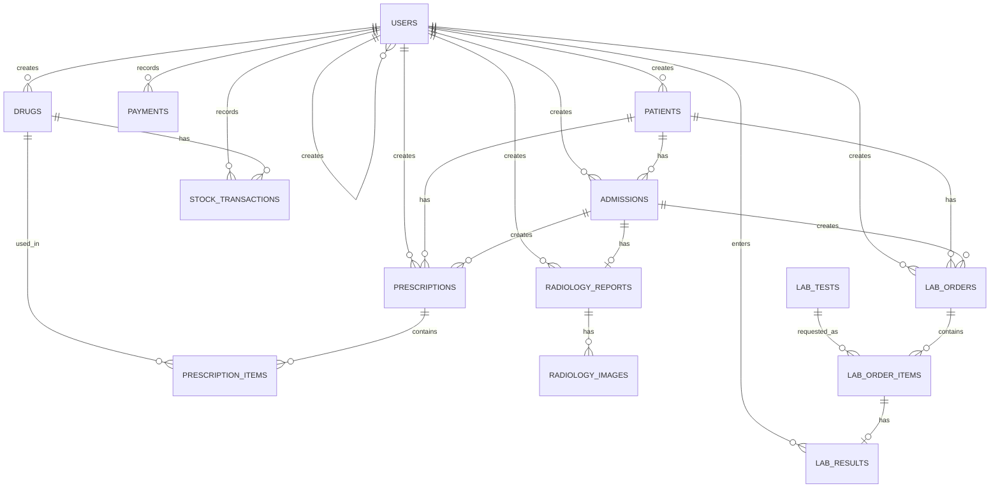

# Data Structure and Relationships

This file describes the implemented SQLite data model in a format suitable for UML class diagrams and EER diagrams. The physical schema is created by `init_db()` in `database.py`.

## Entity Summary

| Entity | Table | Purpose |
| --- | --- | --- |
| User | `users` | Staff accounts and role authorization |
| Patient | `patients` | Patient demographic record |
| Admission | `admissions` | Doctor, laboratory, or radiology encounter/request |
| Payment | `payments` | Payment record for admissions, prescriptions, or lab orders |
| Drug | `drugs` | Pharmacy drug catalog |
| StockTransaction | `stock_transactions` | Inventory movement ledger |
| Prescription | `prescriptions` | Prescription header |
| PrescriptionItem | `prescription_items` | Drug line items in a prescription |
| RadiologyReport | `radiology_reports` | One report for one radiology admission |
| RadiologyImage | `radiology_images` | Uploaded image metadata for a radiology report |
| LabTest | `lab_tests` | Laboratory test catalog and reference ranges |
| LabOrder | `lab_orders` | Laboratory order header |
| LabOrderItem | `lab_order_items` | Requested tests in a lab order |
| LabResult | `lab_results` | Result value for one lab order item |

## Tables and Attributes

### users

| Column | Type | Key | Nullable | Notes |
| --- | --- | --- | --- | --- |
| `id` | INTEGER | PK | No | Autoincrement |
| `username` | TEXT | UNIQUE | No | Login username |
| `password_hash` | TEXT |  | No | Hashed password |
| `full_name` | TEXT |  | No | Staff display name |
| `role` | TEXT |  | No | `admin`, `reception`, `doctor`, `laboratory`, `radiologist`, `pharmacy` |
| `is_active` | INTEGER |  | Yes | Defaults to `1` |
| `created_at` | TEXT |  | Yes | Defaults to current timestamp |
| `created_by` | INTEGER | FK | Yes | References `users.id` logically |

### patients

| Column | Type | Key | Nullable | Notes |
| --- | --- | --- | --- | --- |
| `id` | INTEGER | PK | No | Autoincrement |
| `national_id` | TEXT | UNIQUE | No | Patient national ID |
| `full_name` | TEXT |  | No | Patient name |
| `phone` | TEXT |  | No | Contact number |
| `birth_date` | TEXT |  | No | Stored as date string |
| `gender` | TEXT |  | No | `male`, `female`, `other` |
| `address` | TEXT |  | Yes | Optional |
| `created_at` | TEXT |  | Yes | Defaults to current timestamp |
| `created_by` | INTEGER | FK | No | References `users.id` logically |

### admissions

| Column | Type | Key | Nullable | Notes |
| --- | --- | --- | --- | --- |
| `id` | INTEGER | PK | No | Autoincrement |
| `patient_id` | INTEGER | FK | No | References `patients.id` logically |
| `admission_type` | TEXT |  | No | `doctor`, `laboratory`, `radiology` |
| `description` | TEXT |  | No | Reason or clinical description |
| `radiology_type` | TEXT |  | Yes | Used for radiology admissions |
| `status` | TEXT |  | Yes | `waiting_payment`, `paid`, `completed`, `cancelled` |
| `created_at` | TEXT |  | Yes | Defaults to current timestamp |
| `created_by` | INTEGER | FK | No | References `users.id` logically |
| `paid_at` | TEXT |  | Yes | Payment timestamp |
| `paid_by` | INTEGER | FK | Yes | References `users.id` logically |
| `completed_at` | TEXT |  | Yes | Completion timestamp |

### payments

| Column | Type | Key | Nullable | Notes |
| --- | --- | --- | --- | --- |
| `id` | INTEGER | PK | No | Autoincrement |
| `payable_type` | TEXT |  | No | `admission`, `prescription`, `lab_order` |
| `payable_id` | INTEGER | Polymorphic FK | No | References table selected by `payable_type` |
| `amount` | NUMERIC |  | No | Paid amount |
| `receipt_number` | TEXT |  | Yes | Generated receipt code |
| `status` | TEXT |  | Yes | Defaults to `paid`; can be `cancelled` |
| `created_at` | TEXT |  | Yes | Defaults to current timestamp |
| `created_by` | INTEGER | FK | No | References `users.id` logically |

### drugs

| Column | Type | Key | Nullable | Notes |
| --- | --- | --- | --- | --- |
| `id` | INTEGER | PK | No | Autoincrement |
| `name` | TEXT |  | No | Drug name |
| `manufacturer` | TEXT |  | No | Manufacturer |
| `form` | TEXT |  | No | Tablet, syrup, ampoule, etc. |
| `dosage` | TEXT |  | No | Strength/dose text |
| `default_instructions` | TEXT |  | No | Default usage text |
| `price` | NUMERIC |  | No | Unit price |
| `min_threshold` | INTEGER |  | Yes | Low stock threshold, default `10` |
| `created_at` | TEXT |  | Yes | Defaults to current timestamp |
| `created_by` | INTEGER | FK | No | References `users.id` logically |

### stock_transactions

| Column | Type | Key | Nullable | Notes |
| --- | --- | --- | --- | --- |
| `id` | INTEGER | PK | No | Autoincrement |
| `drug_id` | INTEGER | FK | No | References `drugs.id` logically |
| `quantity_change` | INTEGER |  | No | Positive for stock-in, negative for stock-out |
| `reason` | TEXT |  | No | Restock or dispense reason |
| `created_at` | TEXT |  | Yes | Defaults to current timestamp |
| `created_by` | INTEGER | FK | No | References `users.id` logically |

Current stock is derived:

```text
current_stock(drug) = SUM(stock_transactions.quantity_change WHERE drug_id = drug.id)
```

### prescriptions

| Column | Type | Key | Nullable | Notes |
| --- | --- | --- | --- | --- |
| `id` | INTEGER | PK | No | Autoincrement |
| `patient_id` | INTEGER | FK | No | References `patients.id` logically |
| `admission_id` | INTEGER | FK | Yes | References `admissions.id`; null for manual prescriptions |
| `is_manual` | INTEGER |  | Yes | `1` for pharmacy manual prescription |
| `total_amount` | NUMERIC |  | No | Sum of item prices times quantities |
| `status` | TEXT |  | Yes | `waiting_payment`, `paid`, `dispensed`, `cancelled` |
| `created_at` | TEXT |  | Yes | Defaults to current timestamp |
| `created_by` | INTEGER | FK | No | References `users.id` logically |
| `dispensed_at` | TEXT |  | Yes | Dispense timestamp |
| `dispensed_by` | INTEGER | FK | Yes | References `users.id` logically |

### prescription_items

| Column | Type | Key | Nullable | Notes |
| --- | --- | --- | --- | --- |
| `id` | INTEGER | PK | No | Autoincrement |
| `prescription_id` | INTEGER | FK | No | References `prescriptions.id` logically |
| `drug_id` | INTEGER | FK | No | References `drugs.id` logically |
| `quantity` | INTEGER |  | No | Dispensed quantity |
| `instructions` | TEXT |  | No | Usage instructions |

### radiology_reports

| Column | Type | Key | Nullable | Notes |
| --- | --- | --- | --- | --- |
| `id` | INTEGER | PK | No | Autoincrement |
| `admission_id` | INTEGER | UNIQUE FK | No | References `admissions.id` logically |
| `report_text` | TEXT |  | No | Report content |
| `created_at` | TEXT |  | Yes | Defaults to current timestamp |
| `created_by` | INTEGER | FK | No | References `users.id` logically |

### radiology_images

| Column | Type | Key | Nullable | Notes |
| --- | --- | --- | --- | --- |
| `id` | INTEGER | PK | No | Autoincrement |
| `report_id` | INTEGER | FK | No | References `radiology_reports.id` logically |
| `filename` | TEXT |  | No | UUID-based stored filename |
| `uploaded_at` | TEXT |  | Yes | Defaults to current timestamp |

### lab_tests

| Column | Type | Key | Nullable | Notes |
| --- | --- | --- | --- | --- |
| `id` | INTEGER | PK | No | Autoincrement |
| `code` | TEXT | UNIQUE | No | Test code, e.g. CBC |
| `name` | TEXT |  | No | Test name |
| `category` | TEXT |  | Yes | Test category |
| `sample_type` | TEXT |  | Yes | Blood, urine, etc. |
| `price` | NUMERIC |  | No | Defaults to `0` |
| `male_normal_range` | TEXT |  | Yes | Male reference range text |
| `female_normal_range` | TEXT |  | Yes | Female reference range text |
| `unit` | TEXT |  | Yes | Result unit |
| `is_active` | INTEGER |  | Yes | Defaults to `1` |

### lab_orders

| Column | Type | Key | Nullable | Notes |
| --- | --- | --- | --- | --- |
| `id` | INTEGER | PK | No | Autoincrement |
| `patient_id` | INTEGER | FK | No | References `patients.id` logically |
| `admission_id` | INTEGER | FK | No | References `admissions.id` logically |
| `total_amount` | NUMERIC |  | No | Defaults to `0` |
| `status` | TEXT |  | Yes | `waiting_payment`, `paid`, `collected`, `resulted`, `cancelled` |
| `clinical_note` | TEXT |  | Yes | Doctor/reception note |
| `created_at` | TEXT |  | Yes | Defaults to current timestamp |
| `created_by` | INTEGER | FK | No | References `users.id` logically |
| `paid_at` | TEXT |  | Yes | Payment timestamp |
| `paid_by` | INTEGER | FK | Yes | References `users.id` logically |
| `completed_at` | TEXT |  | Yes | Result completion timestamp |

### lab_order_items

| Column | Type | Key | Nullable | Notes |
| --- | --- | --- | --- | --- |
| `id` | INTEGER | PK | No | Autoincrement |
| `order_id` | INTEGER | FK | No | References `lab_orders.id` logically |
| `test_id` | INTEGER | FK | No | References `lab_tests.id` logically |
| `price` | NUMERIC |  | No | Price copied from lab test at order time |
| `notes` | TEXT |  | Yes | Per-test note |

### lab_results

| Column | Type | Key | Nullable | Notes |
| --- | --- | --- | --- | --- |
| `id` | INTEGER | PK | No | Autoincrement |
| `order_item_id` | INTEGER | UNIQUE FK | No | References `lab_order_items.id` logically |
| `value` | TEXT |  | No | Result value |
| `flag` | TEXT |  | Yes | `low`, `normal`, `high`, or null |
| `entered_at` | TEXT |  | Yes | Defaults to current timestamp |
| `entered_by` | INTEGER | FK | No | References `users.id` logically |

## Relationships for EER Diagram

Use these cardinalities when drawing the EER diagram:

| Parent | Child | Cardinality | Relationship |
| --- | --- | --- | --- |
| `users` | `users` | 1 to many | `users.created_by` creates users |
| `users` | `patients` | 1 to many | `patients.created_by` |
| `users` | `admissions` | 1 to many | `admissions.created_by` |
| `users` | `admissions` | 1 to many optional | `admissions.paid_by` |
| `users` | `payments` | 1 to many | `payments.created_by` |
| `users` | `drugs` | 1 to many | `drugs.created_by` |
| `users` | `stock_transactions` | 1 to many | `stock_transactions.created_by` |
| `users` | `prescriptions` | 1 to many | `prescriptions.created_by` |
| `users` | `prescriptions` | 1 to many optional | `prescriptions.dispensed_by` |
| `users` | `radiology_reports` | 1 to many | `radiology_reports.created_by` |
| `users` | `lab_orders` | 1 to many | `lab_orders.created_by` |
| `users` | `lab_orders` | 1 to many optional | `lab_orders.paid_by` |
| `users` | `lab_results` | 1 to many | `lab_results.entered_by` |
| `patients` | `admissions` | 1 to many | A patient can have many admissions |
| `patients` | `prescriptions` | 1 to many | A patient can have many prescriptions |
| `patients` | `lab_orders` | 1 to many | A patient can have many lab orders |
| `admissions` | `prescriptions` | 1 to many optional | Doctor admission can create prescriptions |
| `admissions` | `lab_orders` | 1 to many | Admission can create lab orders |
| `admissions` | `radiology_reports` | 1 to 0..1 | One radiology admission can have one report |
| `drugs` | `stock_transactions` | 1 to many | Drug stock ledger |
| `drugs` | `prescription_items` | 1 to many | Drug appears on prescription lines |
| `prescriptions` | `prescription_items` | 1 to many | Prescription contains line items |
| `radiology_reports` | `radiology_images` | 1 to many | Report can have multiple images |
| `lab_tests` | `lab_order_items` | 1 to many | Test catalog item used in orders |
| `lab_orders` | `lab_order_items` | 1 to many | Order contains requested tests |
| `lab_order_items` | `lab_results` | 1 to 0..1 | One result per ordered test |

## Polymorphic Payment Relationship

`payments.payable_type` and `payments.payable_id` form a polymorphic relationship:

```text
payments.payable_type = 'admission'    -> payments.payable_id references admissions.id
payments.payable_type = 'prescription' -> payments.payable_id references prescriptions.id
payments.payable_type = 'lab_order'    -> payments.payable_id references lab_orders.id
```

In an EER diagram, model this as either:

- A polymorphic association from `Payment` to `Admission`, `Prescription`, and `LabOrder`.
- Or three optional relationships with a note that only one target is valid depending on `payable_type`.

## UML Class Diagram Notes

Suggested class names:

- `User`
- `Patient`
- `Admission`
- `Payment`
- `Drug`
- `StockTransaction`
- `Prescription`
- `PrescriptionItem`
- `RadiologyReport`
- `RadiologyImage`
- `LabTest`
- `LabOrder`
- `LabOrderItem`
- `LabResult`

Suggested enums:

```text
UserRole = admin | reception | doctor | laboratory | radiologist | pharmacy
Gender = male | female | other
AdmissionType = doctor | laboratory | radiology
AdmissionStatus = waiting_payment | paid | completed | cancelled
PrescriptionStatus = waiting_payment | paid | dispensed | cancelled
LabOrderStatus = waiting_payment | paid | collected | resulted | cancelled
PaymentStatus = paid | cancelled
PaymentPayableType = admission | prescription | lab_order
ResultFlag = low | normal | high
```

## Mermaid ER Diagram Starter


